# 変更まとめ (2026-05-31 〜 2026-06-01)

このセッションで入った UI / 機能変更を、画面ショット付きでまとめたもの。
スクショは `docs/screenshots/` 配下、`frontend/scripts/take-screenshots.mjs`
を実行すると再生成できる（バックエンド + Vite dev server が動いてる前提）。

---

## 1. モバイル対応 — 全ページの土台

コミット: [`a0e1ce4`](https://github.com/shinguakira/forex-chart-history-analysis/commit/a0e1ce4)

### Header

10タブのナビを `md:` (≥768px) 以上で従来通り横並び表示、それ未満はハンバーガー
+ 全幅ドロップダウンに格納。ヘッダー高は 49px のまま (`MainLayout` の
`h-[calc(100vh-49px)]` を壊さない)。

| 折りたたみ | メニューを開いた状態 |
|---|---|
|  | 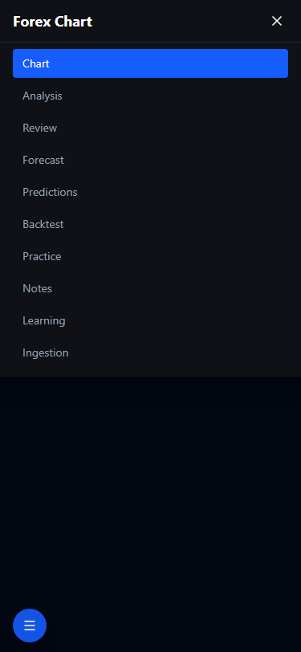 |

### MainLayout (`/` route)

`md:` 以上は従来通りドラッグ可変サイドバー。モバイルは左下に青の FAB
(`Menu` アイコン)。タップで左から drawer がスライドイン、暗い backdrop が
チャート側を覆う。Pair をタップすると drawer が閉じてチャートに戻る。

| FAB のみ | drawer 展開 | pair 選択後（キャンバス全画面） |
|---|---|---|
| 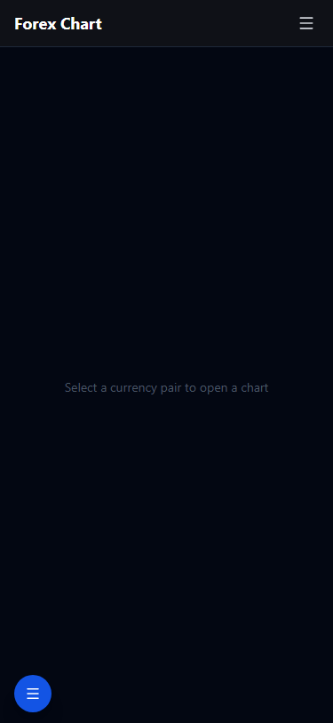 | 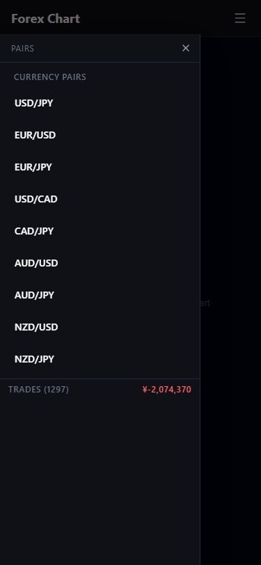 | 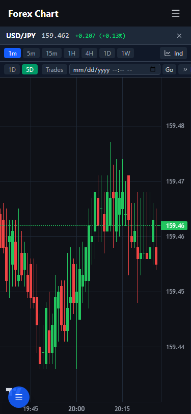 |

### ChartWindow

モバイル時は store の x/y/width/height を無視して `inset:0` でキャンバス
全画面、ドラッグ・リサイズハンドルは非表示 (指タップで chart が drift しない)。

### デスクトップ (1280) 比較

何も変わってない。`md:` ゲートで全部囲ってあるので回帰なし。

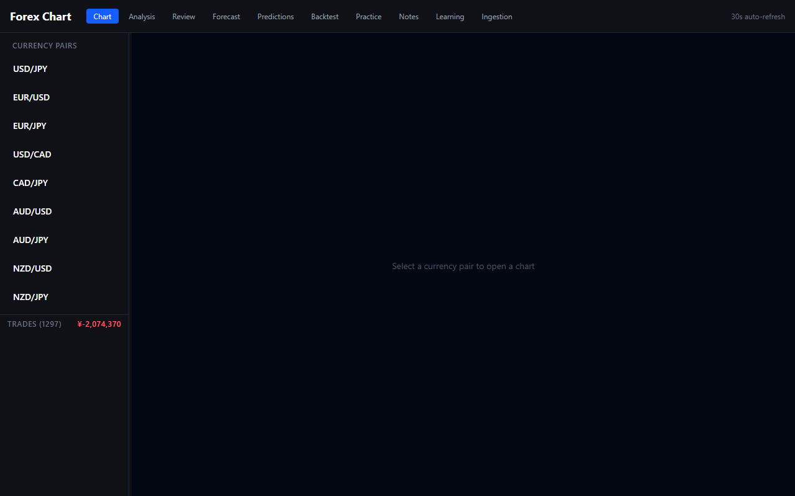

---

## 2. Practice History — CSV / JSON エクスポート

コミット: [`2b53862`](https://github.com/shinguakira/forex-chart-history-analysis/commit/2b53862)

History タブのツールバー右側に `↓ CSV` `↓ JSON` ボタン2個。今のフィルタで
絞られた answer 群だけを download blob で出す。バックエンドルート追加ゼロ。

- **CSV**: 25列フラット (id, mode, pair, timeframe, cutoff_iso, created_iso,
  verdict, pips, replay_* / quiz_* / setup_* 各種)
- **JSON**: `{exportedAt, count, trades: PracticeTrade[]}` ラッパー

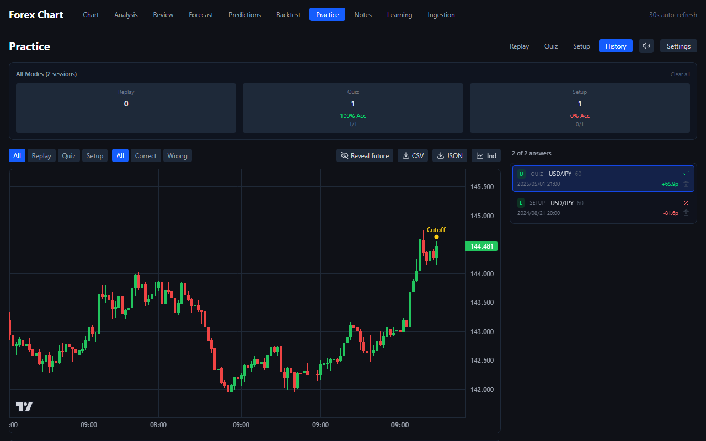

実装: [frontend/src/lib/practice-export.ts](../frontend/src/lib/practice-export.ts) /
[HistoryMode.tsx](../frontend/src/components/practice/HistoryMode.tsx)

---

## 3. Notes — Markdown レンダリング

コミット: [`2b53862`](https://github.com/shinguakira/forex-chart-history-analysis/commit/2b53862)

View モードを `react-markdown` + `remark-gfm` 経由でレンダリング。GFM
(table / task list / strikethrough / autolink) 対応。Edit モードは plain
textarea のままなので、ソース of truth はユーザが打った文字列そのまま。

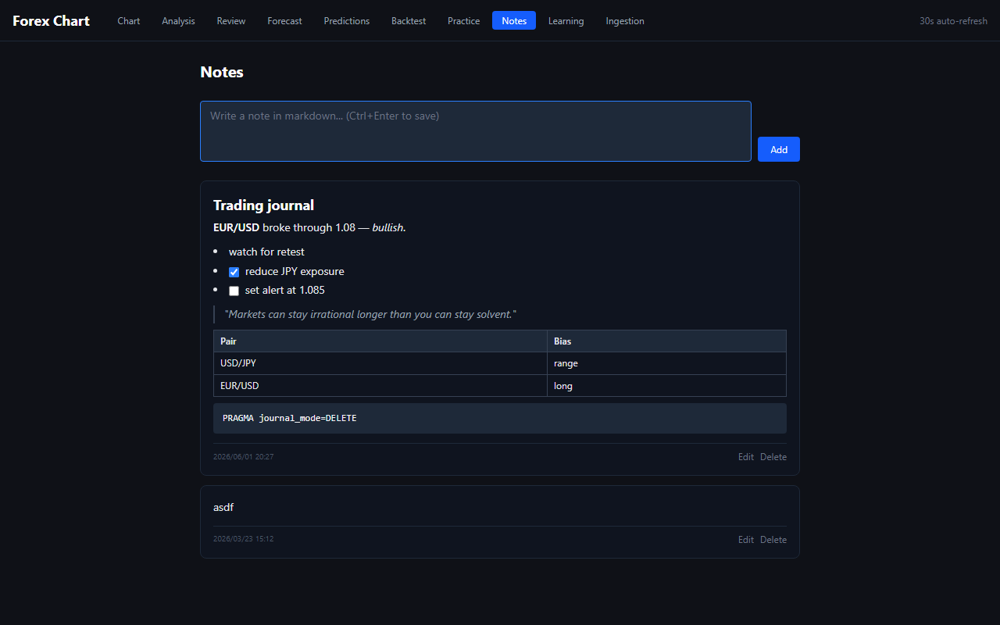

実装: [frontend/src/components/notes/NoteMarkdown.tsx](../frontend/src/components/notes/NoteMarkdown.tsx) /
[NotesPage.tsx](../frontend/src/components/notes/NotesPage.tsx)

---

## 4. AI Key Required バナー — flash 抑制

コミット: [`050eadb`](https://github.com/shinguakira/forex-chart-history-analysis/commit/050eadb)

`useIsAIConfigured()` を boolean → `{configured, loading}` に変更。Predictions
/ Forecast / Review / Backtest の各ページで:

- ロード中: ヘッダーに控えめな `⏳ checking…` のみ
- 解決後 configured=false: 橙バナー表示
- 解決後 configured=true: 緑の `API configured`

これでナビゲーションごとに橙バナーが一瞬光るのが消えた。

実装: [frontend/src/hooks/use-is-ai-configured.ts](../frontend/src/hooks/use-is-ai-configured.ts) + 4ページ

---

## 5. Practice モバイル UX (P-mob1 / P-mob3 / P-mob5 / P7)

コミット: [`00a9061`](https://github.com/shinguakira/forex-chart-history-analysis/commit/00a9061)

### P-mob1 — 下部 sticky アクションバー

各モードで `md:` 未満のとき viewport 下端にプライマリ操作を固定。
親指でリーチできるサイズに拡大。

| Quiz (asking) | Quiz (revealed) | Setup (judgement picked) | Replay |
|---|---|---|---|
| 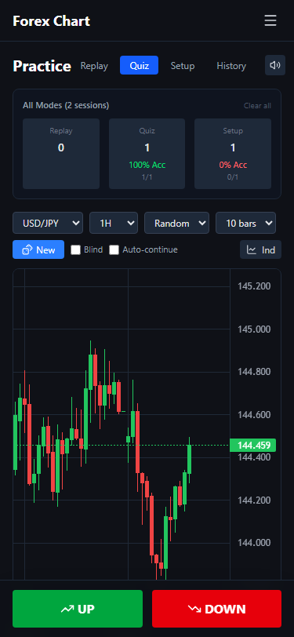 | 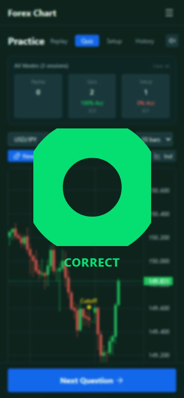 | 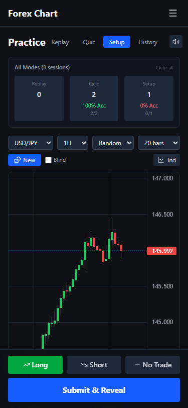 | 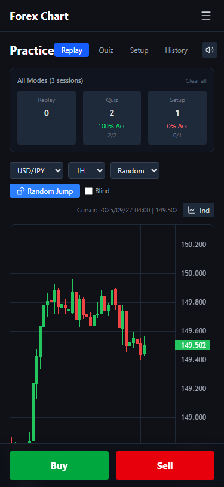 |

- Quiz: asking 中は `UP / DOWN`、reveal 後は `Next Question →` 全幅
- Setup: 3つの chip (Long/Short/No-trade) + Submit ボタン。Confidence と
  Reason は上のフォームに残し、sticky bar には primary CTA だけ置く
- Replay: ノーポジ時は `Buy / Sell`、ポジ open 中は Unrealized 表示 +
  `Close @ price` + `Cancel`

### P-mob3 — チャート高 60vh

全モードのチャートコンテナを `h-[480/520]px` → `h-[60vh] md:h-[480/520]px`。
モバイルで画面の6割を占めて見やすい。HistoryMode も同じ。

(↑ Quiz / Setup / Replay のスクショで6割を占めてるのが確認できる)

### P-mob5 — スワイプでタブ切替

PracticePage 全体に touch イベントハンドラ。横スワイプ閾値 60px かつ
縦移動の 1.5倍以上ある時にビュー切替: `replay → quiz → setup → replay`。
History は循環外。チャートコンテナには `data-no-swipe` 属性を付けて
lightweight-charts の pan ジェスチャを侵さない。

### P7 — Quiz 連続モード + ストリーク

`practice-store` に `quizAutoContinue` を永続化フラグとして追加。Quiz の
ツールバーに `Auto-continue` チェックボックス、reveal 後 1500ms で
自動的に次の問題に進む。連続正解は別途 ref で track して、3 以上で
`🔥 N in a row` を toolbar に表示 (`Flame` icon)。

### デスクトップ Replay の比較

3カラム (toolbar / chart / right panel) のレイアウトは無変更。

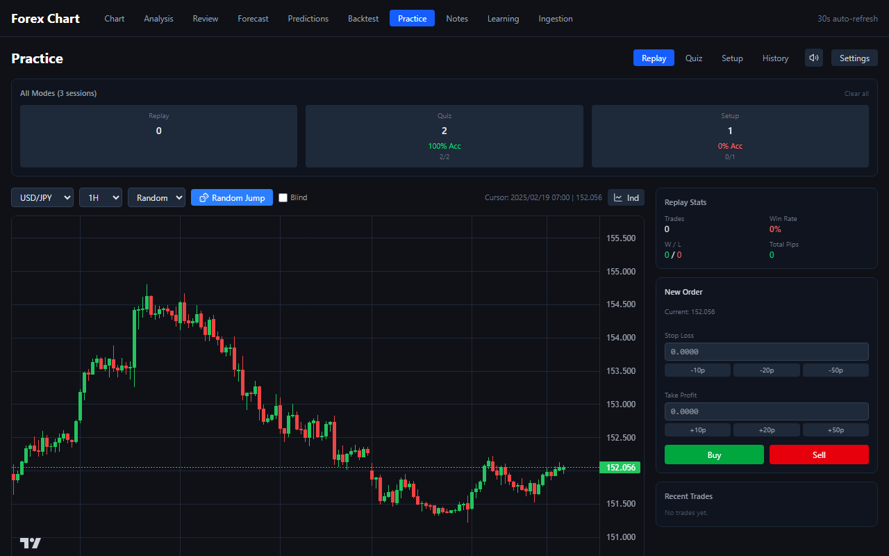

実装:
- [frontend/src/components/practice/PracticePage.tsx](../frontend/src/components/practice/PracticePage.tsx) — swipe handler
- [ReplayMode.tsx](../frontend/src/components/practice/ReplayMode.tsx) / [QuizMode.tsx](../frontend/src/components/practice/QuizMode.tsx) / [SetupMode.tsx](../frontend/src/components/practice/SetupMode.tsx) — sticky bar
- [store/practice-store.ts](../frontend/src/store/practice-store.ts) — quizAutoContinue

---

## Azure 側の変更 (UI ではなく構成)

おまけ。チャート同セッションで以下も入れた:

| | 内容 | 関連 |
|---|---|---|
| デプロイ | Azure Container Apps `forex-chart-container` を `DefaultResourceGroup-EJP` / 既存 Container Apps env に作成 | [docs/DEPLOY.md](DEPLOY.md) |
| イメージ | GHCR (`ghcr.io/shinguakira/forex-chart-history-analysis`) に CI push、`:sha-<short>` で固定 | [.github/workflows/docker-publish.yml](../.github/workflows/docker-publish.yml) |
| 永続化 | Litestream (SQLite local + Azure Blob レプリケーション) | [Dockerfile](../Dockerfile) / [litestream.yml](../litestream.yml) / [entrypoint.sh](../entrypoint.sh) |
| CD | GHA → OIDC → `az containerapp update` (要 GHA secrets 3個: `AZURE_CLIENT_ID` / `AZURE_TENANT_ID` / `AZURE_SUBSCRIPTION_ID`) | docker-publish.yml の deploy ジョブ |
| Budget | 月¥5000 アラート on `DefaultResourceGroup-EJP` (80% / 100% で email) | — |

公開 URL: <https://forex-chart-container.ambitiouscoast-ff70cb4e.japaneast.azurecontainerapps.io/>
